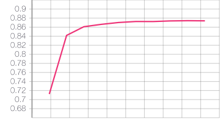

# Classification of IT support tickets using LSTM


- Jean-Marc Orliaguet, jmo@chalmers.se 
- Andreas Jonassson, andreas@chalmers.se 
- Mahsa Eshtehardi, mahsae@chalmers.se

IT-Office, Chalmers University of Technology, Oct. 2019


## Background

The IT-office at Chalmers receives about 30000 support tickets from students and employees each year that are manually sorted and placed into queues for  handling by different competence groups. Being able to automate the task of placing tickets into queues would save significant amounts of work. 

In our work we have trained a neural network using a data-set with about 150 000 entries using supervised learning. Input features where the title and body of a ticket. 

Target was queue where the ticket was solved.  We conclude that using LSTM neural network with a multilabel classification layer is enough to reach 87-88 % accuracy when sorting tickets into 40 classes. This is result is very promising and by working on data quality the result could be improved further.

## Installation

python3 is required

```
$ git clone https://github.com/Chalmers-IT/ticket-classification.git

$ cd ticket-classification
$ pip install -r requirements.txt
```

## Generate random sample data

**Only for testing**: The generated test data is random.

```
$ python generate-sample-data.py
```

## Train the model
```
$ python run.py

Loading data from 'data.ft' ...           project                                               text
0            Larm  cubsec 160487 bäste kund bifogat finner rappor...
1             Nät  cthxx ex se 20191014 unregistered use cthxx ex...
2             Nät  unknown hosts c3se se finns flera ip adresser ...
3             Nät  snic support 197352 autoreply unknown hosts c3...
4         Lagring  lagring se omstart gssd restart gssd sol ita s...
5             Nät  cron dhcp pool service dhcp pool dhcp pool 019...
6             Nät  print filter changes stats2 cdg se statistik p...
7      Certifikat  certificate requested cfab se certificate requ...
8  Närservice Ost  leverans dell latitude 5400 institution depart...
9             Nät  commserv anomaly alert consolo cdg troligen se...
```

## Viewing tensorboard logs:

```
$ tensorboard --logdir logs
```

Open your web browser at http://localhost:6006

## Finding most common words
Some of the most common words should be added to the list of excluded words (see COMMON_WORDS in constants.py)
```
$ python get-common-words.py

0: 120101
16: 113099
129: 92091
information: 81469
1: 56468
e: 55151
r: 51002
l: 50583
dc: 50508
com: 47357
2: 47283
number: 44523
yes: 43239
kr: 42582
error: 39558
td: 39164
n: 39084
remaining: 38574
capacity: 37379
run: 37354
recovery: 36861
https: 36806
fatal: 36769
f: 36189
address: 34881

```

## Accuracy

Validation and test accuracy is 87-88%



```

Parsing 102515/156407 files ... DONE
project                                               text
0            Larm  cubsec utryckningsrapport 160487 bäste kund bi...
1             Nät  cthxx ex se 20191014 unregistered use cthxx ex...
2             Nät  unknown hosts c3se se finns flera ip adresser ...
3             Nät  snic support 197352 autoreply unknown hosts c3...
4         Lagring  lagring se omstart gssd restart gssd sol ita s...
5             Nät  cron dhcp pool service dhcp pool dhcp pool 019...
6             Nät  print filter changes stats2 cdg se statistik p...
7      Certifikat  certificate requested cfab se certificate requ...
8  Närservice Ost  leverans dell latitude 5400 institution depart...
9             Nät  commserv anomaly alert consolo cdg troligen se...

...
--- Starting trial: run-20191027-093156
{'emb_size': 200, 'batch_size': 128, 'lstm_size': 100, 'max_seq_len': 500, 'max_nb_words': 50000, 'epochs': 10}

...

Train on 92263 samples, validate on 10252 samples
Epoch 1/10
92263/92263 [==============================] - 672s 7ms/step - loss: 1.4293 - accuracy: 0.5798 - val_loss: 0.9567 - val_accuracy: 0.7123
Epoch 2/10
92263/92263 [==============================] - 669s 7ms/step - loss: 0.8154 - accuracy: 0.7654 - val_loss: 0.6098 - val_accuracy: 0.8418
Epoch 3/10
92263/92263 [==============================] - 650s 7ms/step - loss: 0.5575 - accuracy: 0.8490 - val_loss: 0.5318 - val_accuracy: 0.8610
Epoch 4/10
92263/92263 [==============================] - 620s 7ms/step - loss: 0.4584 - accuracy: 0.8744 - val_loss: 0.5000 - val_accuracy: 0.8662
Epoch 5/10
92263/92263 [==============================] - 621s 7ms/step - loss: 0.3947 - accuracy: 0.8901 - val_loss: 0.4931 - val_accuracy: 0.8703
Epoch 6/10
92263/92263 [==============================] - 619s 7ms/step - loss: 0.3488 - accuracy: 0.9029 - val_loss: 0.4876 - val_accuracy: 0.8725
Epoch 7/10
92263/92263 [==============================] - 620s 7ms/step - loss: 0.3191 - accuracy: 0.9107 - val_loss: 0.4913 - val_accuracy: 0.8724
Epoch 8/10
92263/92263 [==============================] - 621s 7ms/step - loss: 0.2908 - accuracy: 0.9175 - val_loss: 0.5034 - val_accuracy: 0.8738
Epoch 9/10
92263/92263 [==============================] - 616s 7ms/step - loss: 0.2700 - accuracy: 0.9222 - val_loss: 0.5113 - val_accuracy: 0.8743
Epoch 10/10
92263/92263 [==============================] - 620s 7ms/step - loss: 0.2508 - accuracy: 0.9275 - val_loss: 0.5400 - val_accuracy: 0.8740
10252/10252 [==============================] - 16s 2ms/step
Test set
  Loss: 0.540
  Accuracy: 0.874
```

## References

- J.Brownlee, How to Develop a Bidirectional LSTM For Sequence Classification in Python with Keras, June. 2017. https://machinelearningmastery.com/develop-bidirectional-lstm-sequence-classification-python-keras/
- J.Brownlee, How to Clean Text for Machine Learning with Python, Aug. 2019. https://machinelearningmastery.com/clean-text-machine-learning-python/
- H.Heidenreich, Text Classification in Keras A Simple Reuters News Classifier, Aug. 2018.  https://towardsdatascience.com/text-classification-in-keras-part-1-a-simple-reuters-news-classifier-9558d34d01d3

- SLi, Multi-Class Text Classification with LSTM, Apr. 2019.  https://towardsdatascience.com/multi-class-text-classification-with-lstm-1590bee1bd17 
- TensorBoard: TensorFlow's visualization toolkit  https://www.tensorflow.org/tensorboard
